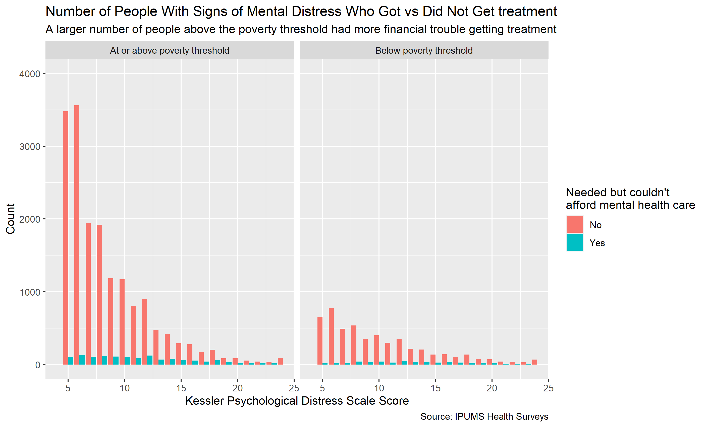
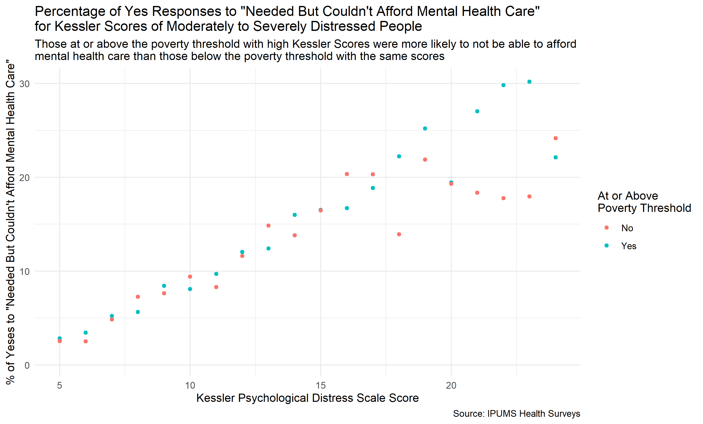

```{r setup, include=FALSE}
knitr::opts_chunk$set(echo = FALSE)
library(knitr)
# Learn more about creating websites with Distill at:
# https://rstudio.github.io/distill/website.html

# Learn more about publishing to GitHub Pages at:
# https://rstudio.github.io/distill/publish_website.html#github-pages

```
## Introduction
Mental health has become an increasingly prevalent issue throughout the United States. I wanted to know how financial factors affect access to mental health care. Some of these factors included income and whether a person was above or below the poverty threshold. I found that both the number of people and the percentage of people who 
needed but could not afford mental health care was actually higher for those at or above the poverty threshold.

### Plot 1
```{r}

```
Poverty doesn't seem to affect access to mental health care as there is a larger number of people at or above the poverty threshold who claimed they could not afford care. But a better way to truly compare these two sides of the poverty threshold is to use percentages as there are far more responses from those at or above the poverty threshold.

### Plot 2
```{r}

```
Like the previous plot, this again shows that those at or above the poverty threshold can not afford mental health care. A possible reason for this counter intuitive result is the subjectivity of the responses to "Needed but could not afford mental health care." The explanation on the IPUMS NHIS states that "'Mental health care or counseling' was defined by the survey respondent."[@IPUMS_NHIS] The varying definitions that result from this may lead to the results of this analysis
