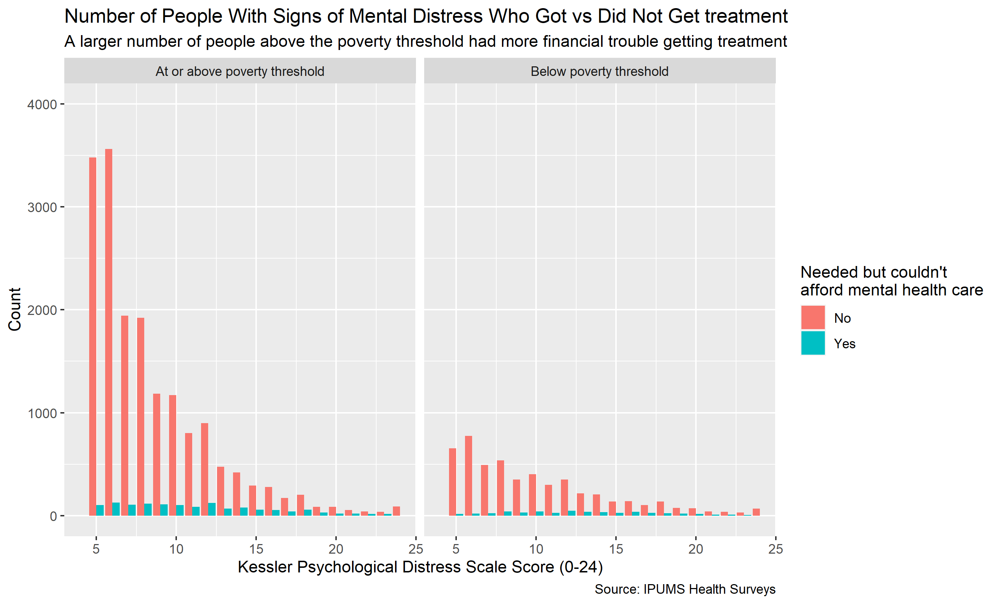

```{r setup, include=FALSE}
knitr::opts_chunk$set(echo = FALSE)
library(knitr)
# Learn more about creating websites with Distill at:
# https://rstudio.github.io/distill/website.html

# Learn more about publishing to GitHub Pages at:
# https://rstudio.github.io/distill/publish_website.html#github-pages

```
##Introduction
Mental health has become an increasingly prevalent issue throughout the United States. I wanted to know how financial factors affect access to mental health care. Some of these factors included income and whether a person was above or below the poverty threshold. I found that both the number of people and the percentage of people who 
needed but could not afford mental health care was actually higher for those at or above the poverty threshold.

```{r}

```

```{r}
include_graphics("mental_plot2.png")
```

